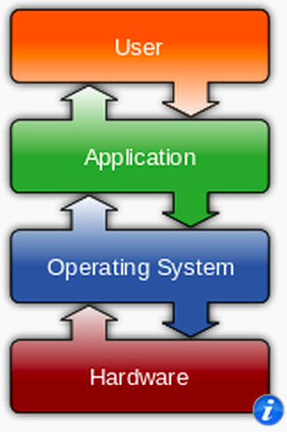

<section>
	<h2>CIS 527</h2>  Lab 1 - Introduction
</section>
<section>
	<h3>Module 1 - Secure Workstations</h3>
	<ul>
		<li>Install VM Software</li>
		<li>Install Windows & Ubuntu</li>
		<li>Configure Users & Files</li>
		<li>Software & Security</li>
	</ul>
</section>
<section>
	<h3>Operating Systems</h3>
	
	
  
Image Source: <a href="http://en.wikipedia.org/wiki/Microsoft_Windows">Wikipedia</a> and <a href="http://en.wikipedia.org/wiki/Ubuntu_(operating_system)">Wikipedia</a>

</section>
<section>
	<h3>Architecture</h3>
	
	
Image Source: <a href="http://en.wikipedia.org/wiki/Operating_system">Wikipedia</a>

</section>
<section>
	<h3>Kernel</h3>
	
	
Image Source: <a href="http://en.wikipedia.org/wiki/Operating_system">Wikipedia</a>

</section>
<section>
	<h3>OS Components</h3>
	<ul>
		<li>Graphical User Interface (GUI)</li>
		<li>Command Line Interface (CLI)</li>
		<li>Program Manager</li>
	</ul>
</section>
