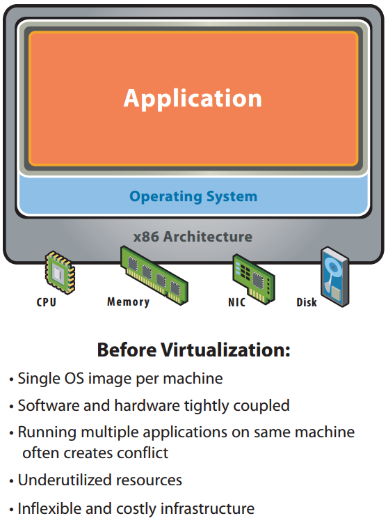
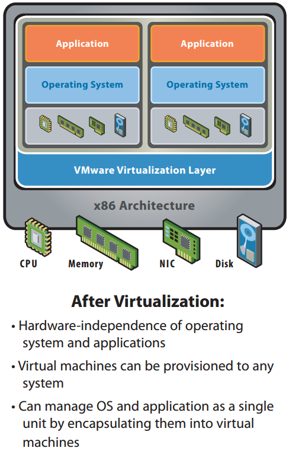
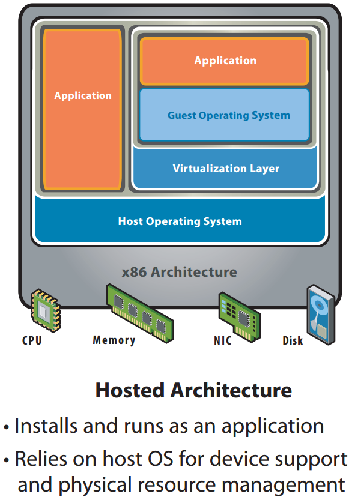
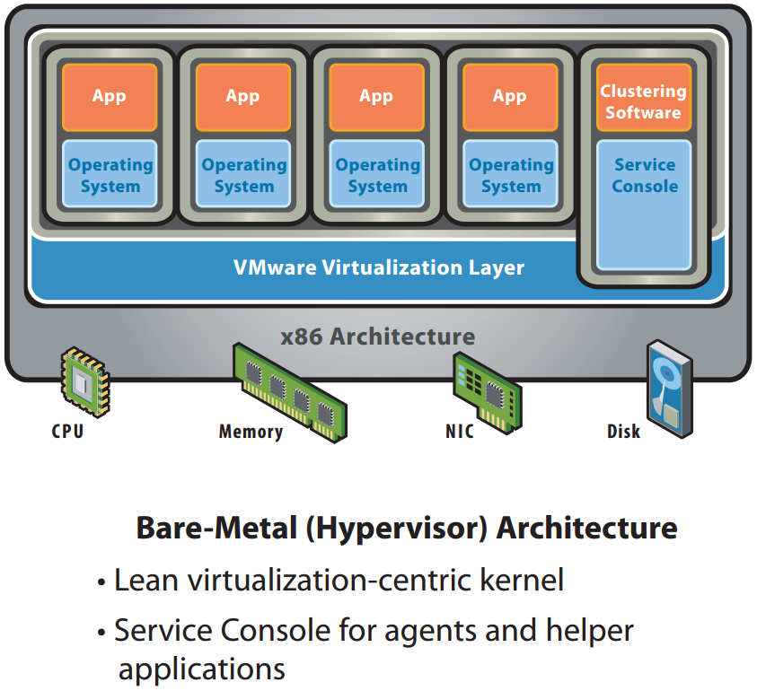
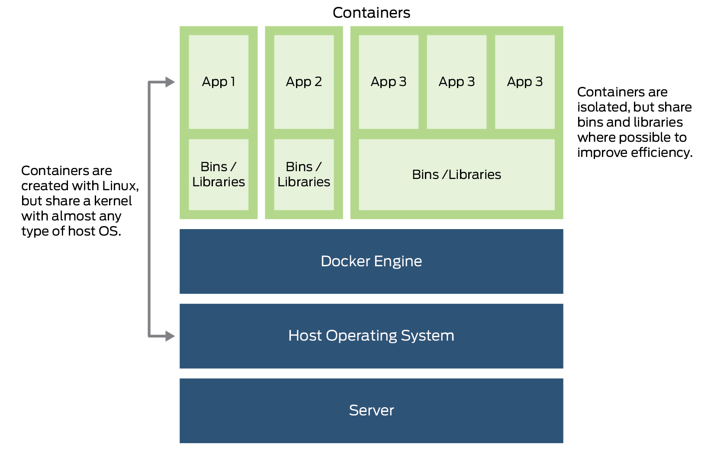
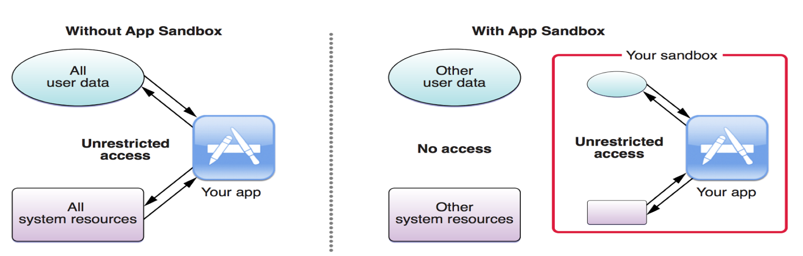
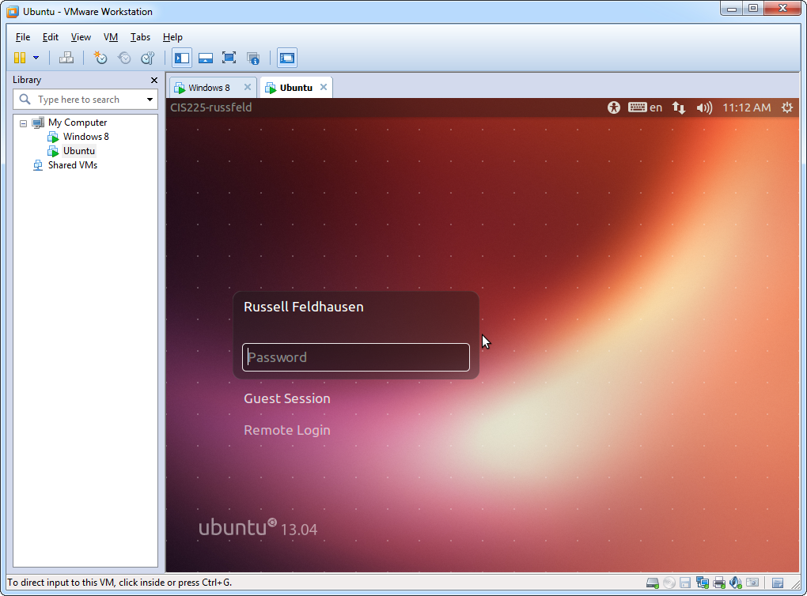

<section>
	<h2>CIS 527</h2>  Lab 1 - Virtualization & VMware
</section>
<section>
	<h3>How a Computer Works</h3>
  <h5>Simple Version</h5>
  <ul>
    <li>The OS loads Application Software into Memory</li>
    <li>The Software sends Instructions to the Hardware via the OS</li>
    <li>The Hardware Performs the Operations using Electronic Circuits</li>
  </ul>
</section>
<section>
	
	
Image Source: <a href="https://www.vmware.com/pdf/virtualization.pdf">VMware</a>

</section>
<section>
  <h3>Virtualization</h3>
  <ul>
    <li>Software that <i>Emulates</i> Hardware</li>
    <li>Run Multiple OS Simultaneously on Single Computer</li>
    <li>Easily Migrate OS Across Hardware</li>
    <li>Another Layer of Abstraction</li>
  </ul>
</section>
<section>
	
	
Image Source: <a href="https://www.vmware.com/pdf/virtualization.pdf">VMware</a>

</section>
<section>
  <h3>Types of Virtualization</h3>
  <ul>
    <li>Hosted</li>
    <li>Bare-Metal (Hypervisor)</li>
     
    <li>Hardware</li>
    <li>Operating System (Containers)</li>
    <li>Application (Sandboxing)</li>
  </ul>
</section>
<section>
	
	
Image Source: <a href="https://www.vmware.com/pdf/virtualization.pdf">VMware</a>

</section>
<section>
	
	
Image Source: <a href="https://www.vmware.com/pdf/virtualization.pdf">VMware</a>

</section>
<section>
  <h3>Containers</h3>
	
	
Image Source: <a href="https://www.juniper.net/us/en/products-services/what-is/docker-container/">Juniper Networks</a>

</section>
<section>
  <h3>Sandboxing</h3>
	
	
Image Source: <a href="https://orhanobut.github.io/effective-android-security/">Effective Android by orhanobut on Github</a>

</section>
<section>
  <h3>Old & Busted</h3>
  <ul>
    <li>One OS per Server</li>
    <li>One Server per Application</li>
    <li>Storage on each Server</li>
    <li>Lots of Servers</li>
    <li>Inefficient Use of Resources</li>
    <li>Redundancy is Difficult</li>
    <li>Management Nightmare</li>
  </ul>
</section>
<section>
  <h3>New Hotness</h3>
  <ul>
    <li>Many OS on Single Physical Server</li>
    <li>One VM/OS per Application</li>
    <li>Shared, Virtual Storage Pools</li>
    <li>Fewer Physical Servers</li>
    <li>Better Resource Use</li>
    <li>Easily Made Redundant</li>
    <li>Easier to Manage?</li>
  </ul>
</section>
<section>
  <h3>VMware Workstation</h3>
  
</section>
<section>
  <h3>Other VM Software</h3>
  <ul>
    <li>VMware ESX</li>
    <li>Oracle VirtualBox</li>
    <li>Hyper-V</li>
    <li>KVM & QEMU</li>
    <li>Parallels</li>
    <li>Xen</li>
  </ul>
</section>
<section>
  <h3>Cloud Providers</h3>
  <ul>
    <li>Digital Ocean</li>
    <li>Microsoft Azure</li>
    <li>Amazon AWS & S3</li>
    <li>OpenStack</li>
    <li>Rackspace</li>
    <li>Linode</li>
  </ul>
</section>
<section>
  <h3>Containers & More</h3>
  <ul>
    <li>Docker & Swarm</li>
    <li>Kubernetes</li>
    <li>Heroku</li>
    <li>Google App Engine</li>
    <li>Nanobox</li>
  </ul>
</section>
<section>
  <h3>Get Started!</h3>
  
Complete Lab 1, Task 0:

  
Install Virtualization Software

</section>
