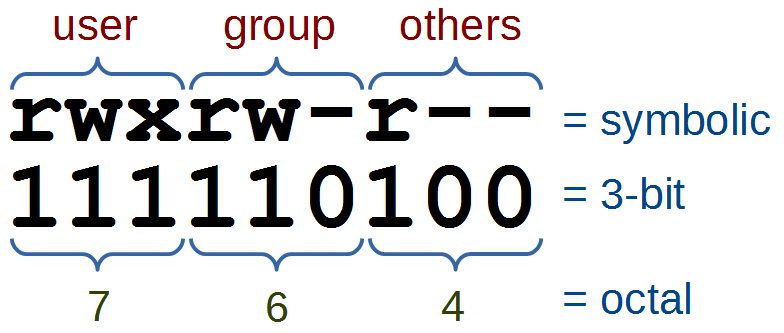
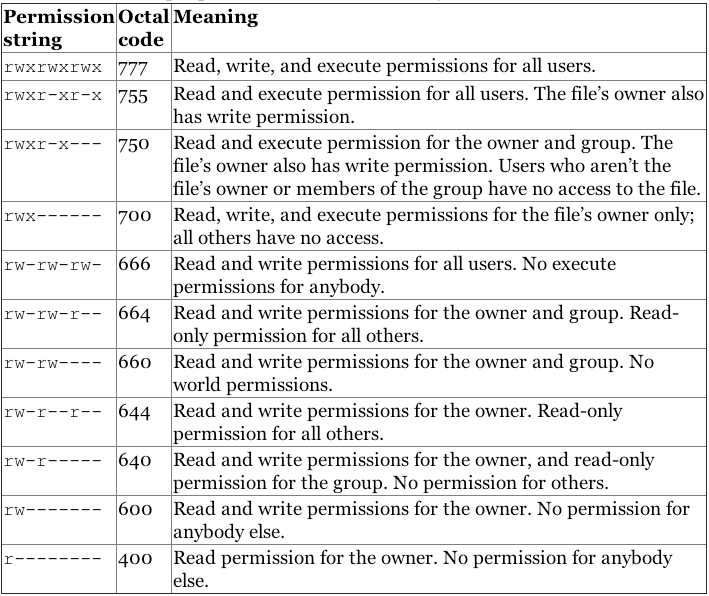

<section>
	<h2>CIS 527</h2>  
Lab 1 - Ubuntu File Permissions

</section>
<section>
  <h3>Linux File Permissions</h3>
  <ul>
    <li>Classes
      <ul>
        <li>User - owner of the file</li>
        <li>Group - group assigned to file</li>
        <li>Others - other users</li>
      </ul>
    </li>
    <li>Permissions
      <ul>
        <li>Read - read file contents</li>
        <li>Write - change/delete file</li>
        <li>Execute - run program or script & list folder contents</li>
      </ul>
    </li>
  </ul>
</section>
<section>
	<h3>File List</h3>
  
  
Image Credit: <a href="https://www.digitalocean.com/community/tutorials/an-introduction-to-linux-permissions">Digital Ocean</a>

</section>
<section>
	<h3>File Modes</h3>
  
  
Image Credit: <a href="https://www.digitalocean.com/community/tutorials/an-introduction-to-linux-permissions">Digital Ocean</a>

</section>
<section>
	<h3>Octal Permissions</h3>
  
  
Image Credit: <a href="https://leanpub.com/jelinux/read">Just Enough Linux</a>

</section>
<section>
	<h3>Common Octal Values</h3>
  
  
Image Credit: <a href="https://www.linode.com/docs/tools-reference/linux-users-and-groups/">Linode</a>

</section>
<section>
  <h3>Modifying Permissions</h3>
  <ul>
    <li>File Browser (Nautilus)</li>
    <li>Edit as Administrator (Using "nautilus-admin")</li>
    <li>Terminal</li>
  </ul>
</section>
<section>
  <h3>Terminal Commands</h3>
  <ul>
    <li>chmod - Change Permissions (Mode)
      <ul>
        <li>chmod [class][op][mode] &lt;path></li>
        <li>chmod [ugoa][+-=][rwx] &lt;path></li>
        <li>chmod [octal_mode] &lt;path></li>
      </ul>
    </li>
    <li>chown - Change Owner
      <ul>
        <li>chown [user]:[group] &lt;path></li>
      </ul>
    </li>
    <li>chgrp - Change Group
      <ul>
        <li>chgrp [group] &lt;path></li>
        <li>Must Own File</li>
      </ul>
    </li>
  </ul>
</section>
<section>
  <h3>Next Step!</h3>
  
Start Lab 1, Task 6:

  
Ubuntu Files & Permissions

</section>
