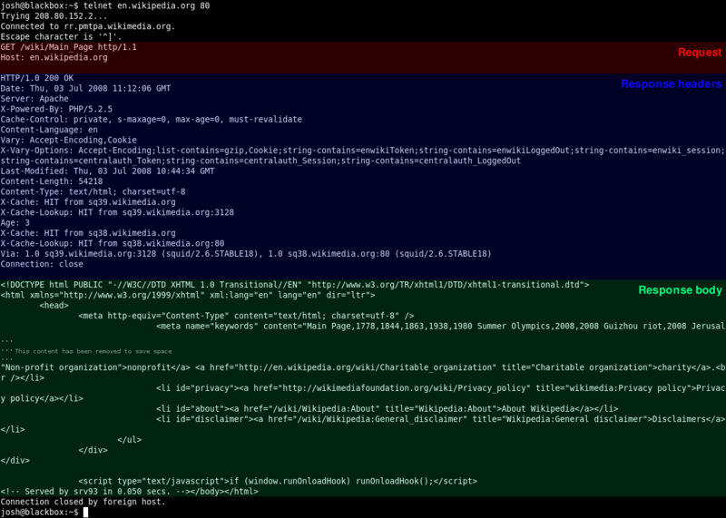

<section>
	<h2>CIS 527</h2>  
Lab 3 - HTTP

</section>
<section>
	<h3>Hypertext Transfer Protocol (HTTP)</h3>
	
	
Image Source: <a href="https://en.wikipedia.org/wiki/Hypertext_Transfer_Protocol">Wikipedia</a>

</section>
<section>
	<h3>HTTP</h3>
	<ul>
		<li>Developed by Tim Berners-Lee at CERN in 1989</li>
		<li>Built On TCP</li>
		<li>Text-Based Protocol</li>
		<li>Used to Access the World Wide Web</li>
	</ul>
</section>
<section>
	<h3>HTTP Commands</h3>
	<ul>
		<li><b>GET</b></li>
		<li><b>POST</b></li>
		<li>HEAD</li>
		<li>PUT</li>
		<li>DELETE</li>
	</ul>
</section>
<section>
	<h3>HTTP Status Codes</h3>
	<ul>
		<li>200 - OK</li>
		<li>301 - Moved Permanently</li>
		<li>403 - Forbidden</li>
		<li>404 - Not Found</li>
		<li>500 - Internal Server Error</li>
		<li>503 - Service Unreachable</li>
	</ul>
</section>
<section>
	
	
Image Source: <a href="https://en.wikipedia.org/wiki/Hypertext_Transfer_Protocol">Wikipedia</a>

</section>
