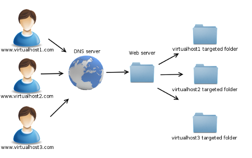

<section>
	<h2>CIS 527</h2>  
Lab 5 - Domains & Virtual Hosts

</section>
<section>
	
	
Image Source: <a href="https://en.wikipedia.org/wiki/Domain_Name_System">Wikipedia</a>

</section>
<section>
	<h3>Domain Name Hierarchy</h3>
	
	
Image Source: <a href="https://en.wikipedia.org/wiki/Domain_name">Wikipedia</a>

</section>
<section>
	<h3>Uniform Resource Locator (URL)</h3>
	
	
Image Source: <a href="https://moz.com/learn/seo/domain">Moz</a>

</section>
<section>
	
	
Image Source: <a href="https://www.namecheap.com">Namecheap</a>

</section>
<section>
	<h3>Register Domain Name</h3>
	<ul>
		<li>Name</li>
		<li>TLD</li>
		<li>DNS Hosting</li>
		<li>DNS Configuration</li>
		<li>WHOIS Information</li>
	</ul>
</section>
<section>
	
	
Image Source: <a href="https://www.apache.org/foundation/press/kit/">Apache Software Foundation</a>

</section>
<section>
	<h3>Virtual Hosts</h3>
	
	
Image Source: <a href="http://www.pimschaaf.nl/xampp-with-virtual-hosts-configuration/">Pimschaaf</a>

</section>
